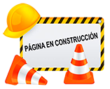

# Unidad III {#alirio}

En esta tercera unidad abordaremos diversos temas como: a) la aplicación de conceptos y principios básicos de la Lecturas de mapas de suelos y la localización de los mismos en el terreno; b) la interpretación de fotografías aéreas como base para la cartografía de suelos, y finalmente c) aplicaremos los conocimientos adquiridos durante la asignatura para realizar una Evaluación de tierras expedita en áreas con escasa información de suelos.

---

### Semana 13 {-}
###### Practica 9: Lectura de Mapas y Ubicación de suelos - Práctica de campo {-}

> Recuerde que la **Guía Práctica de la Unidad 3**, se encuentra incorporada a la guia de la Unidad 2.

<!--  -->

---

### Semana 14 {-}
###### Practica 10: Interpretación de Fotografías aéreas - Aula de clases {-}

<!--  -->

---

### Semana 15 {-}
###### Practica 11: Evaluación de tierras con escasa información - Práctica de campo {-}

<!--  -->

---

### Semana 16 {-}
###### Exposición oral del trabajo extra - aula {-}

---

### Semana 17 {-}
###### Presentación escrita del Examen teórico - práctico {-}

---

### Semana 18 {-}
###### Recuperación de Unidades I, II y III {-}

<!-- --- -->

<!-- 
 -->
<!-- 
 -->
<!-- <a> -->
<!-- </a> -->
<!-- 
 -->
<!-- 
 -->

<!-- --- -->