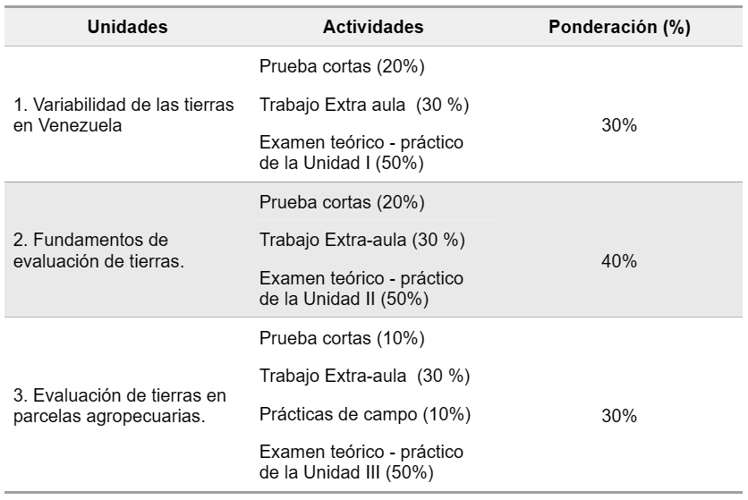

--- 
title: "EVALUACION DE TIERRAS"
author: "Profesores: Victor Sevilla, Juan Carlos Rey y Barbara Rodriguez"
date: "`r Sys.Date()`"
site: bookdown::bookdown_site
documentclass: book
bibliography: [book.bib, packages.bib]
# url: your book url like https://bookdown.org/yihui/bookdown
# cover-image: path to the social sharing image like images/cover.jpg
description: |
  This is a minimal example of using the bookdown package to write a book.
  The HTML output format for this example is bookdown::gitbook,
  set in the _output.yml file.
link-citations: yes
github-repo: rstudio/bookdown-demo

---

# Introduccion a la asignatura {-}

---

### Bienvenida {-}

Los miembros de la cátedra de **Evaluación de Tierras**, le damos la más cordial bienvenida a nuestra asignatura. En nuestra Cátedra nos encontramos muy entusiasmados con el inicio de otro nuevo semestre, en donde los acompañaremos en la aventura de aprender a caracterizar, clasificar y evaluar las tierras agrícolas con el fin de conocer su vocación sostenible.

---

### Instrucciones {-}

En esta página encontrará diferentes elementos necesarios para cursar con éxito nuestra asignatura, tales como: indicaciones generales, programación de actividades, sistemas de evaluación, materiales teóricos, prácticos (guías), datos del trabajo extra - aula, y bibliografías de interés para su lectura. También encontrará enlaces para la descarga de mucha de la información e inclusive link que lo llevaran a videos, formularios o cuestionarios disponibles de la asignatura.

Esta página ha sido diseñada para complementar las actividades presenciales y maximizar las interaccion entre alumnos y profesores sobre las actividades a realizar.

También podrá revisar sus calificaciones, lo que le permitirá llevar un registro de su rendimiento académico.

---

### Objetivos {-}

#### General {-}

El objetivo general de esta asignatura es capacitar a los estudiantes en la evaluación e interpretación de información básica sobre clima, biota, hidrología, suelos, geología y geomorfología, para establecer la capacidad de uso agropecuario que posean las tierras y su aptitudes para usos agrícolas específicos sostenibles.

#### Específicos {-}

* Repasar conceptos generales de Clasificación taxonómica y Cartografía de los suelos.
* Conocer la variabilidad espacial de las tierras en el país,  evidenciando limitaciones, potencialidades y suelos de referencia.
* Aplicar los fundamentos de la Evaluación de las Tierras, mediante metodologías empleadas en el país, altamente comprobadas y de uso generalizado.
* Evaluar en campo las tierras de parcelas agropecuarias con limitada información.

---

### Normas {-}

###### Modalidad Presencial {-}

Evaluación de Tierras es una asignatura del séptimo semestre, y se dicta en una sesión Teórica-práctica de 3 horas de duración los días jueves y viernes en el horario de 1:30 pm – 4:45 pm., en aulas del Departamento de Edafología.

Las sesiones Teórico-prácticas son de obligatoria asistencia, tal como lo establece el reglamento vigente.

Debes asistir a la sección Teórico-prácticas en la cual se inscribió; no puedes recuperar prácticas en otro grupo sin la debida autorización de su profesor y del profesor del grupo al cual quieres asistir.

Solo se te permitirá la recuperación de una práctica por cada Unidad de la asignatura.

La no asistencia o incumplimiento de las actividades programadas por la asignatura deberá ser informada por escrito a la Cátedra dentro de las 48 horas de haber ocurrido la falta, incluyendo las constancias y los avales necesarios para su justificación.

Deberás entregar la comunicación y los avales respectivos en la Secretaría del Departamento de Edafología o enviarla al correo electrónico del profesor  samoy315@gmail.com, donde será considerada en la próxima reunión de cátedra.

Si tienes algún problema personal o actividad permanente que le impida asistir a las clases, debes dirigirte a la Dirección de Escuela o al Consejo de Facultad solicitando aval para las inasistencias, pues la Cátedra no tiene potestad para hacerlo.

La cátedra de Evaluación de Tierras, con sus profesores y todo el personal de apoyo, están a su disposición para orientarte y ayudarte a solventar los problemas que se le puedan presentar, siempre y cuando acudas a ellos, conozcan y acaten las reglas establecidas y asuma con responsabilidad el compromiso con la asignatura.

###### Modalidad Mixta {-}

En esta modalidad compartiremos actividades tanto a distancia como presenciales, estas últimas contemplan algunas prácticas en laboratorio y todas las de campo, además de la totalidad de las evaluaciones que son de obligatoria asistencia.

Para las actividades a distancia dispondremos de varias opciones para el apoyo a los estudiantes: a) Realizaremos reuniones vía meet o zoom en el horario de clases de la asignatura, es decir Jueves y Viernes de 1:30 pm a 4:45 pm. en donde su profesor estara atento a cualquier pregunta, duda o inquietud que tengas los estudiantes. b) la asignatura dispondrá de un canal o grupo en Telegram para aclarar dudas o proporcionar información general de interés para el éxito del semestre. c) También podrá comunicarse con su profesor vía correo electrónico, los cuales se especifican más adelante.

---

### ¿Como aprobar? {-}

Para poder aprobar esta asignatura, deberá obtener una calificación mínima acumulada de 10 puntos (escala de 1 al 20 puntos), basado en la información que se presenta en el siguiente cuadro. Las evaluaciones perdidas contarán como cero puntos.

***Cuadro 1**. Plan de evaluacion de la asignatura*

---

### Profesores {-}

Conozca nuestro personal docente en el **Cuadro 2**. y no está demás hacer de su conocimiento que estamos a su disposición para ayudarlo a avanzar en su proceso de formación y por eso, no dude en contactarnos si lo requiere.

 ***Cuadro 2.** Profesores de la asignatura **Evaluacion de Tierras*** 

|Profesor|Seccion|Correo|
|:---:|:---:|:---:|
|Juan Carlos Rey|Jueves pm|jcrey67@gmail.com|
|Victor Sevilla|Viernes pm|samoy315@gmail.com|
|Barbara Rodriguez|Jueves y Viernes pm|barbara.rodriguez.mg@gmail.com|

---

### Calendario {-}

A continuación en el **Cuadro 3**, se muestran los contenidos de la asignatura de **Evaluación de Tierras**, en su semana correspondiente. Cada unidad dispondrá de materiales de estudio (teóricos - prácticos), actividades y evaluaciones.

Es importante tener en cuenta que **todas** Las evaluaciones se realizarán de manera presencial, en las semanas indicadas.

***Cuadro 3**. Calendario academico*

<h6 style="text-align: center;">Unidad 1</h1>

|Semana|Contenido|
|:---:|:---|
|0|Presentación de la asignatura|
|1|Clasificación taxonómica de suelos|
|2|Cartografía de suelos|
|3|Variabilidad espacial de suelos en Venezuela y **Prueba corta I**|
|4|**Presentación oral de trabajo extra - aula**|
|5|**Presentación de Examen teórico - práctico**|

<h6 style="text-align: center;">Unidad 2</h1>

|Semana|Contenido|
|:---:|:---|
|6|Evaluación de tierras por su capacidad de uso agropecuario|
|7|Directivas FAO: Cualidades y Tipos de utilización de Tierras|
|8|Directivas FAO: Cualidad Humedad Disponible|
|9|Clasificación de tierras según Fertilidad|
|10|Evaluación de tierras con fines de riego|
|11|**Presentación oral de trabajo extra - aula**|
|12|**Presentación de Examen teórico - práctico**|

<h6 style="text-align: center;">Unidad 3</h1>

|Semana|Contenido|
|:---:|:---|
|13|Lectura de Mapas y Ubicación de suelos - **Práctica de campo**|
|14|Interpretación de Fotografías aéreas - Aula de clases|
|15|Evaluación de tierras con escasa información y **Prueba corta**|
|16|**Presentación oral de trabajo extra - aula**|
|17|**Presentación de Examen teórico - práctico**|
|18|**Recuperación de Unidades I, II y III**|
<!-- |xx|<a href="https://youtu.be/JE0vUiCQrvs">prueba</a>| -->

---

 <!-- width="100" height="100" -->
 <!-- [rmarkdown_reference.pdf](https://github.com/JoseCaicedoDev/cardReact/files/9688200/rmarkdown_reference.pdf) -->

<!-- aqui podra descargar el libro de Hobbit [Libro del Hobbit](pdf/hobbit.pdf) -->

<!-- 
 -->
<!-- 
 -->
<!-- <iframe width="400" height = "220" -->
<!-- src="https://www.youtube.com/embed/tgbNymZ7vqY"> -->
<!-- </iframe> -->
<!-- 
 -->
<!-- 
 -->